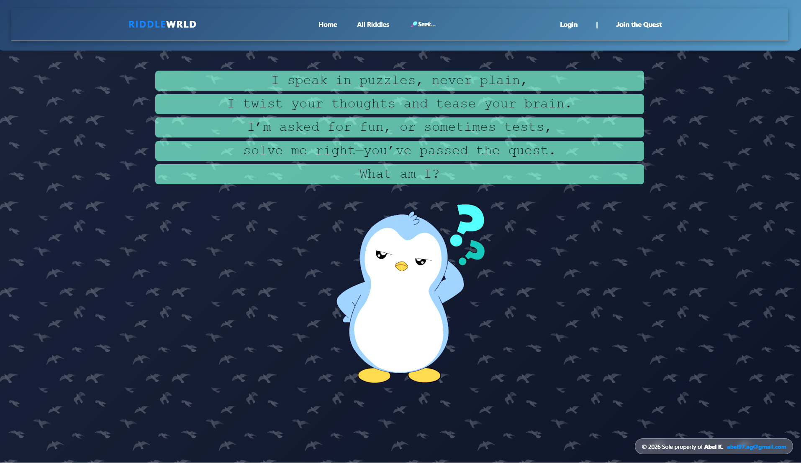
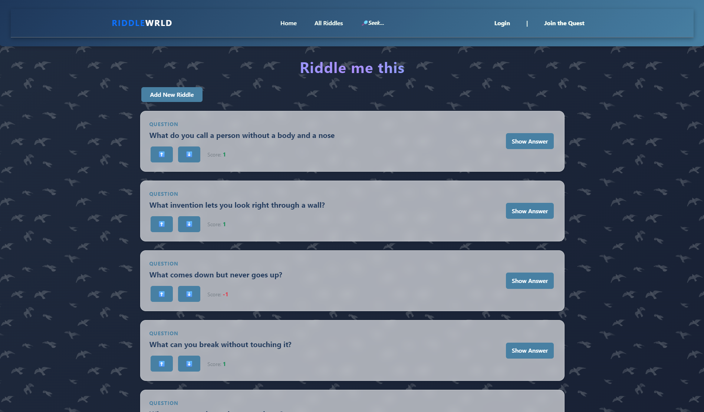
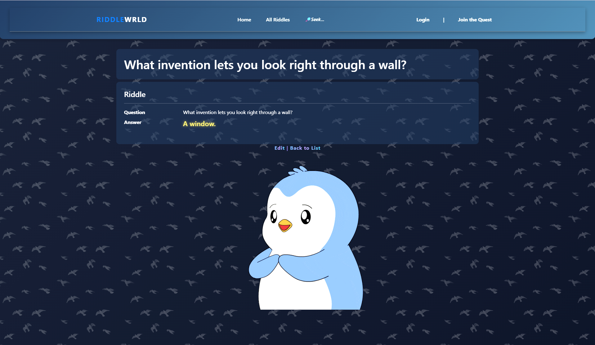
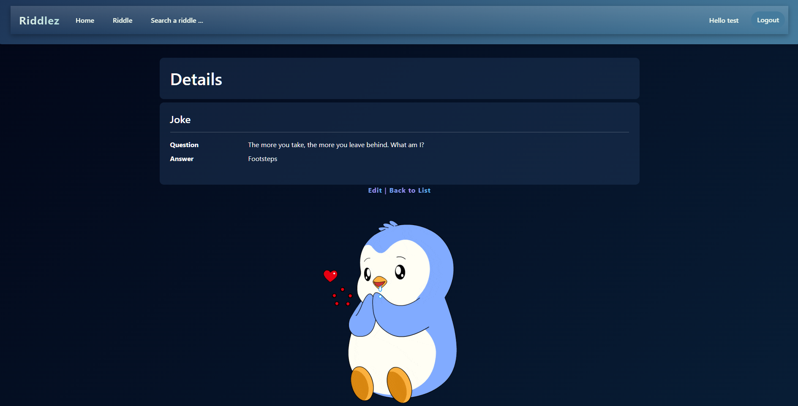
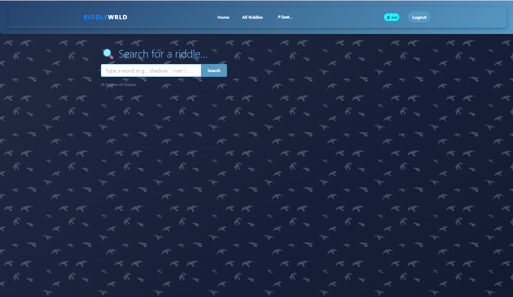

# Welcome to Riddle World

An app for sharing and discovering riddles, made using C# and the ASP.NET framework.
MsSql used as database for storing the riddles, votes and users.
There is a user login and registration page where anyone can create an account so that they can post their riddles with the answer, and other users can upvote or downvote the riddles.
The user can apply 2FA to their account if desired. Additionally, the app follows the MVC model, where the front end can easily be switched with another one.

- App hosted on azure can be found here: [Riddle World]([https://ragincident.streamlit.app/](https://riddleworld-hnhcawbucvatcjhy.westeurope-01.azurewebsites.net/))
- The app is in progress and not yet complete, but here is my work so far...
  # Tech stack

- Code: C#
- Frameworks: .Net, ASP Core, Razor
- Database: MsSQL
- ORM: Entity Framework
- Others: Git & Github, HTML, CSS, JS, Bootstrap, Nuget, Dependency Injection(DI), MVC
  
  
  
  
  
 
